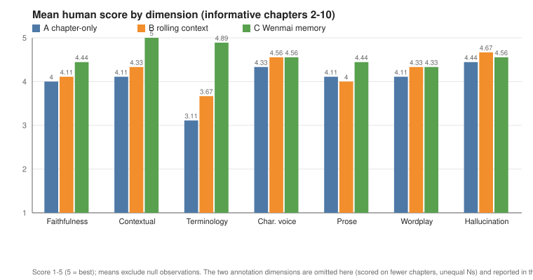
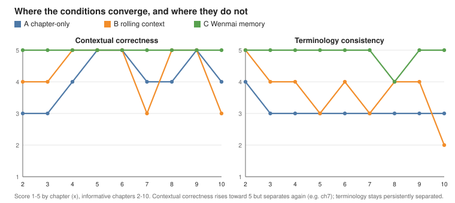

# Wenmai / 文脉

**Translate the words. Preserve the thread.**

*A context-aware long-form translation framework for webnovels, starting with Chinese-to-English
translation.*

Wenmai is an open-source framework for context-aware long-form webnovel translation. Its scope is
multilingual by design; its first supported path is Chinese to English.

Webnovels can span hundreds or thousands of chapters. Understanding a single sentence may depend on
events, relationships, terminology, jokes, titles, or translation choices established hundreds of
chapters earlier. Wenmai is designed around that problem.

Rather than translating each chapter in isolation, Wenmai maintains persistent knowledge of the
story, including characters, aliases, relationships, factions, locations, terminology, abilities,
historical events, recurring jokes, and established translation decisions.

Its goal is not simply to produce fluent English. It is to preserve the meaning carried between the
lines.

When wordplay, idioms, homophones, cultural references, names, deliberate ambiguity, or other
linguistic details cannot survive naturally in translation, Wenmai can preserve readable prose while
providing concise contextual explanations where they genuinely matter.

Chinese-to-English is Wenmai's first supported translation path. The underlying architecture is
intended to support additional source languages over time, with language-specific linguistic
intelligence separated from the shared systems for translation, context, memory, retrieval, and
consistency. (A dedicated evaluation system is planned, not yet built; see Status below.)

The aim is to combine the consistency of a maintained translation project with the contextual
awareness of a human translator who has actually read the story.

Translation is Wenmai's primary purpose. The same canon files also support a narrower second use:
**deterministic name and terminology checking directly against source documents**, with no
translation step and no model call. That works for any language Wenmai can read, including original
English writing checked against its own canon (`en -> en`). It is a consistency check, not a writing
or editing assistant; see [Checking source documents](#checking-source-documents-no-translation).

See [MISSION.md](MISSION.md) for the fuller mission.

## Core principles

- **Context before translation.** Chapters should be translated with relevant narrative and
  linguistic history, not as isolated text.
- **Consistency across long-running stories.** Names, titles, techniques, locations, ranks,
  factions, relationships, and recurring terminology should remain coherent across hundreds or
  thousands of chapters.
- **Meaning over literalism.** English should read naturally without silently discarding information
  carried by the source language.
- **Explain what cannot be translated.** Wordplay, idioms, cultural references, double meanings, and
  other significant linguistic details can be preserved through concise annotations when necessary.
- **Language-aware, not language-bound.** Wenmai begins with Chinese-to-English translation, while
  keeping language-specific linguistic concerns separate from the core translation framework.
- **Human-reviewable by design.** Translation decisions, terminology changes, contextual knowledge,
  annotations, and chapter revisions should remain inspectable and version-controlled.

Wenmai treats translation not as sentence substitution, but as the preservation of a story's 文脉,
the thread of meaning and continuity running through the work.

**It is a tool, not a content repo.** Clone it, run it on your own machine, and point it at your
own novels. By default your novels and translations live under `novels/`, which Git ignores, so
they are not staged by default; you remain responsible for reviewing what you stage, commit, or
share. They can also live in a directory outside the checkout entirely (see
[Where your content lives](#where-your-content-lives)). The only novel
that ships with the repo is the invented `sample-novel` demo. Translation and model-assisted context
extraction need a backend with your own LLM access (see Backends below); deterministic consistency
checking and validation need none.

## The annotation idea

The translator adds an inline note only when a literal rendering would silently drop information a
native reader would catch. Examples:

> He really was a 老狐狸, an "old fox" [a Chinese expression for someone extremely shrewd and
> experienced, not a literal comment on age].

> "You certainly have a lot of qi."
> [Wordplay: 气 can mean "qi/energy" but also "anger" or "temper." The speaker is deliberately
> playing on both.]

And, most of the time, nothing:

> Senior Brother Zhang entered the hall.

Triggers for a note: idioms whose literal form loses meaning, homophones, name jokes, internet
slang, poetry or classical references, scene-critical cultural references, puns, deliberate double
meanings, and terms where the natural English equivalent hides something the source made obvious.
See `prompts/translate.md` for the full rule.

## Repo layout

```
novels/<novel>/   (novels/ is the default content root; see "Where your content lives")
  source/         ch00001_<src>.txt, ...                (immutable source; suffix = source_language)
  translated/     ch00001_<tgt>.md, ...                 (output; suffix = target_language; one PR/chapter)
  context/        characters.yaml terminology.yaml locations.yaml factions.yaml timeline.yaml
                  (+ any novel-specific files, e.g. cultivation_system.yaml, honorifics.yaml)
  translation_memory/phrases.jsonl                     (recurring idioms/jokes, first-seen refs)
  novel.yaml      per-novel config (source_language, target_language, title, prose style pointer)
  style_guide.md  the agreed target-language prose voice for this novel
prompts/          translate.md (language-neutral core), context_update.md, review.md
  languages/      zh.md, ...   (source-language linguistic overlays; ko planned)
scripts/          translate.py build_context.py consistency_check.py validate.py
                  benchmark.py backends.py context.py config.py
                  build_reference_inventory.py plot_benchmark.py   (benchmark analysis helpers)
benchmarks/       <id>/manifest.yaml (metadata only), README.md, results/   (public; no prose)
.github/workflows-example/translate.yml   (CI stub; move into .github/workflows/ to enable)
```

Everything a novel needs to know about its languages lives in `novel.yaml` as `source_language` /
`target_language`. The core loads whatever `*.yaml` a novel puts in `context/`, so genre- or
language-specific files can be added without a code change. See [ARCHITECTURE.md](ARCHITECTURE.md).

## Where your content lives

A workspace (one novel or document set, laid out as above) is looked up under a list of **content
roots**. Exactly one source supplies that list:

1. the `WENMAI_CONTENT_ROOTS` environment variable, if set (several paths separated by `:` on
   Linux/macOS, `;` on Windows). It replaces the `config.yaml` list entirely; those roots are not
   searched as a fallback;
2. otherwise, a `content_roots` list in `config.yaml`;
3. if neither is configured, the bundled `novels/` directory.

Within the selected list, roots are searched in the order given.

```yaml
# config.yaml
content_roots:
  - /path/to/my/workspaces
```

An external root lets your workspaces live in an independently managed (for example, private)
directory, managed separately from Wenmai and not committed to the Wenmai repository. Keeping it
private is up to you: handoff prompts and checker output can still contain its text (see below).
Relative entries resolve against the repository root, and a workspace name found
under more than one root is an error unless `content_roots_on_conflict: first` is set.

Model handoff prompts embed document text. With the `claude_code` backend they are written to
`claude_code.runs_dir` (default `.runs/` inside the checkout, git-ignored); for private content,
set it to an absolute path outside the checkout. Wenmai warns when it would write prompts for
external content inside the checkout. Details: [ARCHITECTURE.md](ARCHITECTURE.md) and
`config.example.yaml`.

## Pipeline (v1 = three passes)

```
Source (zh)  ->  [1] context retrieval  ->  [2] translate + annotate  ->  [3] consistency check  ->  Target (en)
                  (Python, mechanical)       (LLM)                         (Python, mechanical)
```

Source and target are whatever the novel declares; v1 ships and is tested for `zh -> en`.

Later this grows toward the full seven passes (semantic analysis, literary edit, context
extraction as separate stages, knowledge-graph retrieval). See "Roadmap" below.

## Backends (pluggable)

A backend is only about how and where the model is called (transport and provider), never about
language. The call is behind one interface (`scripts/backends.py`), so the same pipeline runs with
any of three backends:

- **`claude_code`** (default): no API key, no per-token billing. The script assembles the full
  prompt into `<runs_dir>/<novel>/<chapter>/<pass>.prompt.md` (`runs_dir` defaults to `.runs`), and
  you (via Claude Code) write the answer to `<pass>.response.md`, then re-run to continue. Good for
  careful, reviewed translation.
- **`anthropic`**: calls the Claude API directly for unattended runs. Needs `ANTHROPIC_API_KEY`.
  This is what a future CI workflow would use.
- **`claude_code_stateless`**: runs each call as a fresh, non-interactive `claude -p` process under
  your Claude Code login, with tools disabled. Unattended like `anthropic`, but no API key.

Pick the backend in `config.yaml` (copy from `config.example.yaml`) or with `--backend`.

## Quick start

```bash
python -m pip install -r requirements.txt
cp config.example.yaml config.yaml          # then edit if using the anthropic backend
```

**Translation workflow** (context retrieval, model-assisted translation, consistency checking):

```bash
# Translate one chapter (default claude_code backend = file handoff)
python scripts/translate.py --novel sample-novel --chapter 1

# Check terminology drift across everything already translated
python scripts/consistency_check.py --novel sample-novel

# Propose new context entries from a finished chapter (writes proposals for review)
python scripts/build_context.py --novel sample-novel --chapter 1
```

**Document consistency workflow** (deterministic checks against a canon you maintain; no
translation, no model calls). For a workspace configured as in
[Checking source documents](#checking-source-documents-no-translation):

```bash
python scripts/validate.py --novel <workspace> --require-first-seen
python scripts/consistency_check.py --novel <workspace>               # whole workspace
python scripts/consistency_check.py --novel <workspace> --chapter 3   # one chapter
```

`novels/sample-novel/` ships as a tiny invented demo so every translation step runs end to end.

### Adding your own novel

```bash
mkdir -p novels/<your-novel>/{source,translated,context,translation_memory}
# add novel.yaml + style_guide.md and source/ch00001_zh.txt ...
# start with EMPTY context/ and translation_memory/ and let the review loop fill them
python scripts/translate.py --novel <your-novel> --chapter 1
```

Use `novels/sample-novel/` as a schema and formatting example (read it), not as context to copy into
a real novel. **For the complete chapter-by-chapter workflow, including the human-reviewed memory loop
used by Wenmai's full persistent-memory condition, see [GETTING_STARTED.md](GETTING_STARTED.md).**

Everything under `novels/<your-novel>/` is git-ignored, so it stays on your machine. To version your
own translations, either keep the workspace in an external content root that is its own (private)
repository (see [Where your content lives](#where-your-content-lives)), or, in a private fork, remove
the `novels/*` lines from `.gitignore` (or add a `!novels/<your-novel>` exception).

Translation is chapter-bounded: when translating chapter *i*, only durable canonical state and
translation memory with `first_seen` **before** chapter *i* enter the prompt, so re-running an earlier
chapter never pulls later-story state backward. Run `scripts/validate.py --require-first-seen` so every
durable record carries the chapter it was learned in.

## Checking source documents (no translation)

The consistency checker can run directly on the documents in `source/`, without producing
translations. This suits original writing (declare `en -> en` for an English manuscript) or any
document set whose names and terms you want held to a canon you maintain in the usual `context/*.yaml`
files. It is opt-in per workspace in `novel.yaml`:

```yaml
source_language: en
target_language: en

consistency:
  documents: source       # translated (default) | source
  first_seen: inclusive   # exclusive (default) | inclusive
```

A complete example workspace, using the normal [chapter file convention](#chapter-file-convention):

```
my-manuscript/
  novel.yaml                  (as above)
  source/ch00001_en.txt
  context/characters.yaml
```

`source/ch00001_en.txt`:

```text
Ana Reyes unlocked the lighthouse door.
By noon, Anna Reyes had counted every step to the lamp room.
```

`context/characters.yaml`:

```yaml
characters:
  ana_reyes:
    preferred: Ana Reyes
    avoid: [Anna Reyes]
    first_seen: ch00001
```

```bash
python scripts/validate.py --novel my-manuscript --require-first-seen
python scripts/consistency_check.py --novel my-manuscript              # whole workspace
python scripts/consistency_check.py --novel my-manuscript --chapter 1  # one chapter
```

Both checks report the planted variant (exit status 1):

```
[consistency] 1 drift issue(s) in my-manuscript:
  ch00001_en.txt:2  'Anna Reyes' -> use 'Ana Reyes'
      By noon, Anna Reyes had counted every step to the lamp room.
```

**`first_seen` semantics.** A per-chapter check (`--chapter N`) applies only canon that exists at
that point in reading order. With `exclusive` (the default, and the translation behaviour) a rule
applies from the chapter *after* its `first_seen`; with `inclusive` it also applies in the chapter
that established it, which is where a newly introduced name is most likely to be misspelled. In the
example above, the exclusive setting reports nothing for `--chapter 1`. A whole-workspace check
always uses the full current canon, in either mode.

These settings affect only `consistency_check.py`. Context retrieval, `translate.py` (including its
pass-3 check) and the benchmark keep their existing behaviour. `validate.py` and
`consistency_check.py` make no model calls.

**Limitations.** The checker:

- detects only the variants listed in canon `avoid` entries; it does not discover every misspelling
  or near-miss on its own;
- may flag deliberate variations, such as a character misnaming someone in dialogue;
- does not evaluate plot, character knowledge, or timeline consistency;
- reads only files that follow the chapter naming convention;
- prints the matching line with each finding, so its output can contain document text.

The context-extraction and editorial-review prompts are written for translation and have not been
adapted for original writing. Wenmai does not provide a writing assistant or editorial pipeline.

## Chapter file convention

Source and translated chapters are named `ch<NNNNN>_<language>.txt` / `.md`, where `<NNNNN>` is a
zero-padded 5-digit chapter number and `<language>` is the novel's `source_language` /
`target_language`:

```
source/ch00001_zh.txt   translated/ch00001_en.md
source/ch00002_zh.txt   translated/ch00002_en.md
```

The pipeline resolves chapters by this exact pattern (no arbitrary filename ingestion).
`scripts/validate.py` flags files that look like chapters but do not match.

## Development

```bash
python -m pip install -r requirements-dev.txt
python -m pytest

# Validate a novel's persistent state (YAML/JSONL validity, language config,
# malformed avoid/fields, translation-memory lines, duplicate canonical entries):
python scripts/validate.py --novel sample-novel
```

The suite covers language configuration and validation, context loading, translation continuity,
consistency checking (including source-document mode), content-root resolution and path safety, the
Claude Code handoff backend, and an end-to-end pipeline run on the bundled `sample-novel` using a
fake backend (no API calls). It tests behaviour, not implementation details.

## Why GitHub

Wenmai is designed so chapter translations and context changes can be reviewed as Git diffs and, in
future automated workflows, surfaced as pull requests. Today you run the scripts locally and commit
the results yourself; the diffs still show every terminology change, added note, and new context
entry. If you rename a term 600 chapters in, git history and search make it feasible to find and fix
every prior occurrence.

## Benchmarks

A controlled A/B/C benchmark tests whether structured persistent memory beats a plain rolling
context window, on real long-form fiction. The harness (`scripts/benchmark.py`) and manifests are
public; all corpus text (source, official reference, generated candidates) stays local and
git-ignored. See [benchmarks/README.md](benchmarks/README.md) for conditions, blinding, evaluation
dimensions, and methodology caveats.

### LOTM results (chapters 1-10, final blind phase)

**Directional, not proof.** Run `lotm-opus48-v1` (`claude-opus-4-8`, independent mode) is **10 / 10
chapters complete** with **9 informative chapters** (chapter 1 is non-informative: the three
conditions get equivalent prompts before any history exists). Across those nine, **Condition C
finished first in 8/9**, the exception being **chapter 9 (`B > C > A`)** where rolling context won on
character voice while C still held the best terminology score. With n = 9, one run, one corpus, and
ordinal scores, this is repeated directional evidence, not a statistically significant result.

The most useful finding is *where* the conditions differ. **Contextual correctness does not simply
saturate**: it rises toward the maximum but separates again (chapter 7, and B drops again at chapter
10), so the immediate source chapter plus a capable model often, but not always, recovers narrative
context. **Terminology consistency stays the most persistently separated**: chapter-only keeps
drifting on established renderings, rolling context fluctuates with its window (dropping to 2 at
chapter 10), and the human-reviewed persistent-memory condition preserves the frozen decisions most
consistently, with only a single terminology-score dip to 4 in chapter 8.
The durable advantage of structured memory here is translation-state continuity, not an every-chapter
win: C did not lead every literary dimension, and chapter 9 is an explicit counter-example.





Full methodology, per-chapter tables, the extraction-audit findings, and limitations are in the
[chapters 1-10 results write-up](benchmarks/lotm/results/lotm-opus48-v1_ch00001-ch00010.md); the
derived scores behind these figures are in
[the accompanying CSV](benchmarks/lotm/results/lotm-opus48-v1_ch00001-ch00010_scores.csv), and the
figures regenerate with `python scripts/plot_benchmark.py`. Earlier
[chapters 1-6](benchmarks/lotm/results/lotm-opus48-v1_ch00001-ch00006.md) and
[chapters 1-3](benchmarks/lotm/results/lotm-opus48-v1_ch00001-ch00003.md) checkpoints are kept
unchanged as historical provenance. During the blind phase the official English translation had not
been inspected; that comparison is a separate, post-hoc phase, summarized next and kept visibly
apart from this frozen blind checkpoint.

### Post-hoc reference analysis (separate from the frozen blind phase)

After the blind benchmark was frozen and published, and after a 77-item comparison universe was
preregistered, the run was compared against the **official English translation of the Chinese
source**. Access to the official translation occurred **only after** those freezes. The Chinese
source stays the primary evidence and **matching the official translation is not correctness**.

Headline (77-item preregistered universe, item-level terminology continuity):

- **C: 0 material drift among 76 determinate preregistered items** (76 consistent, 0 drift, 1 indeterminate)
- **B: 1 drift item**
- **A: 3 drift items**
- **A = B = C = 53/63 = 84.1%** agreement with the official English translation on the common
  determinate post-hoc subset, i.e. C's advantage is internal continuity, not resemblance to the
  official translation.

Details: [reference-analysis report](benchmarks/lotm/reference_analysis/lotm-opus48-v1_reference_analysis.md),
[protocol](benchmarks/lotm/REFERENCE_ANALYSIS_PROTOCOL.md),
[pre-reference manifest](benchmarks/lotm/reference_analysis/PRE_REFERENCE_MANIFEST.md),
[provenance](benchmarks/lotm/reference_analysis/REFERENCE_PROVENANCE.md), and the
[aggregate metrics CSV](benchmarks/lotm/reference_analysis/lotm-opus48-v1_reference_metrics.csv).

## Status: implemented vs planned

Implemented in v1 (this repo; translation tested for `zh -> en`):
- Three-pass flow: context retrieval, LLM translate + annotate, terminology-drift consistency check.
- Per-novel context records, translation memory, and language-neutral core with a `zh` overlay.
- Pluggable backends (`claude_code` handoff, `anthropic` API, `claude_code_stateless` CLI).
- Context-extraction pass that proposes reviewable additions (never auto-applied).
- State validator (`scripts/validate.py`).
- A/B/C benchmark harness (`scripts/benchmark.py`) with blinding and deterministic + human eval.
- Configurable content roots, so workspaces can live outside the repository checkout.
- Opt-in source-document consistency checking (deterministic, no model), including `en -> en`
  original writing, with inclusive or exclusive `first_seen` bounding.

Planned, NOT yet built:
- A dedicated evaluation system (automated scoring beyond the benchmark's deterministic checks;
  human review and the benchmark harness exist, but there is no standalone eval pipeline yet).
- Automated GitHub Actions that translate on push and open pull requests (the workflow in
  `.github/workflows-example/` is a disabled stub, not an active pipeline).
- Split semantic / literary-edit passes; knowledge-graph or embedding retrieval; automatic merging
  of accepted proposals; additional source languages.

## Roadmap

- v1 (this): repo + Markdown chapters + YAML context + pluggable script + three-pass flow, for
  Chinese to English. The core is kept language-neutral so the next language pair is additive.
- Next: split translation into semantic / prose / literary-edit passes; automatic context
  extraction on merge; a real GitHub Actions workflow (on the `anthropic` backend) that opens PRs.
- Later: a dedicated evaluation system; additional source languages (Korean to English is the
  expected next pair, added as a `prompts/languages/ko.md` overlay plus any ko-specific context
  files, with no core rewrite); a small novel knowledge graph for retrieval; chapter ingestion from
  raw dumps; a reader interface.

## License

The tool (scripts, prompts, schema, and the invented `sample-novel`) is released under the
[MIT License](LICENSE). Use it, fork it, build on it.

## A note on rights

This project is translation *tooling*. It does not host, bundle, or distribute any copyrighted novel
content, and the maintainers are not responsible for what anyone translates with it. Web-novel
source text is copyrighted by its authors and publishers. You are responsible for how you obtain
source chapters and what you do with the output, including any redistribution. Keep your own novels
and translations local (that is the default; see "It is a tool, not a content repo" above). The
shipped `sample-novel` is fully invented for this repo.
