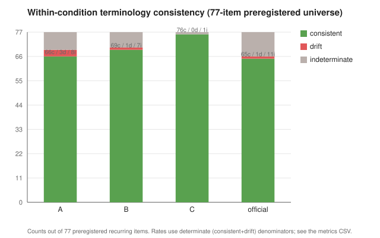

# LOTM reference analysis: run `lotm-opus48-v1` (post-hoc, chapters 1-10)

Post-hoc comparison of the frozen blind benchmark against the **official English translation of the
Chinese source**. This is **not** a new experiment and does **not** modify the frozen blind
benchmark. Aggregate, methodology-safe results only: no Chinese source, candidate, or official
chapter prose appears here.

## 1. Status and provenance

This reference analysis was performed **only after**, in order: generation, blind evaluation,
unblinding, human curation, canonical-state freeze, blind cumulative publication, reference-analysis
protocol freeze, and preregistration of the 77-item comparison universe. The official English
translation was **not available** to generation, evaluation, curation, or the blind aggregate
analysis.

- Protocol (frozen before exposure): [`../REFERENCE_ANALYSIS_PROTOCOL.md`](../REFERENCE_ANALYSIS_PROTOCOL.md)
- Preregistered universe manifest: [`PRE_REFERENCE_MANIFEST.md`](PRE_REFERENCE_MANIFEST.md)
- Reference provenance (checksums, alignment): [`REFERENCE_PROVENANCE.md`](REFERENCE_PROVENANCE.md)
- Aggregate metrics (this report's numbers): [`lotm-opus48-v1_reference_metrics.csv`](lotm-opus48-v1_reference_metrics.csv)

Reference: official English translation of the Chinese source. Chapters: 1-10. Alignment: clean 1:1.

## 2. What the reference means

- **Chinese source = primary evidence.**
- **Official English translation = post-hoc published comparison reference.**
- **Matching the official translation != correctness.**

The official English translation is not a gold-standard answer key. It may paraphrase, localize,
compress, or choose different but source-defensible wording. Every judgment here returns to the
Chinese source.

## 3. Preregistered universe and verification

The comparison universe is **77 source-driven recurring items** (34 of them proper-name / entity
items), built only from the frozen Chinese chapters plus the frozen human-reviewed canonical state
and translation memory, and frozen **before** any official-reference exposure.

Preregistered inventory SHA-256: `4f5f2abbfbdb54fd9754a0a646acf4a01d04b488ea32c1e491f499e25c0e6b32`

Occurrence-level verification of the classification:
- **30 items** passed a **conservative occurrence-count audit** (every stream renders the frozen
  form at least as many times as the source occurrences in each chapter, leaving no room for a
  within-chapter alternate). This is a conservative count check, not a formal token-level alignment
  proof.
- **47 items** were **manually alignment-reviewed**.

No classification changed during this verification.

## 4. Primary result: within-stream terminology continuity

Within-condition recurrence consistency over the preregistered 77-item universe (determinate =
consistent + drift; indeterminate excluded from the rate):

| stream | consistent | drift | indeterminate | determinate | rate |
|---|:---:|:---:|:---:|:---:|:---:|
| A | 66 | 3 | 8 | 69 | .957 |
| B | 69 | 1 | 7 | 70 | .986 |
| C | 76 | 0 | 1 | 76 | 1.000 |
| official | 65 | 1 | 11 | 66 | .985 |

**Condition C showed zero material drift among its determinate preregistered items: 76 consistent,
0 drift, 1 indeterminate.** (The 1 indeterminate, item_072, is unresolved, not proven consistent.)

Drift items: A = 3 (item_020, item_032, item_042); B = 1 (item_032); C = 0; official = 1 (item_032).

This directionally supports the frozen blind terminology-continuity finding (blind
terminology-consistency means C 4.89 > B 3.67 > A 3.11). No statistical significance is claimed.

## 5. Proper-name / entity consistency (34-item subset)

| stream | consistent | drift | indeterminate | determinate | rate |
|---|:---:|:---:|:---:|:---:|:---:|
| A | 30 | 2 | 2 | 32 | .938 |
| B | 31 | 1 | 2 | 32 | .969 |
| C | 34 | 0 | 0 | 34 | 1.000 |
| official | 29 | 1 | 4 | 30 | .967 |

Determinate denominators differ; they are shown explicitly.

## 6. Agreement with the official English translation

Descriptive published-reference agreement (**not** accuracy), over the 77-item universe:

| stream | agreement | determinate | rate |
|---|:---:|:---:|:---:|
| A | 54 | 65 | 83.1% |
| B | 53 | 64 | 82.8% |
| C | 56 | 66 | 84.8% |

The determinate denominators differ (65 / 64 / 66), so the small raw ordering is **not** a meaningful
rank. Agreement with the official English translation was **similar across A/B/C, roughly 83-85%
among determinate items**.

**Post-hoc common-determinate subset** (the N=63 items determinate for A, B, and C, identical
denominator):

| stream | agreement | N | rate |
|---|:---:|:---:|:---:|
| A | 53 | 63 | 84.1% |
| B | 53 | 63 | 84.1% |
| C | 53 | 63 | 84.1% |

On the common determinate subset, A, B, and C each matched the official English translation on
exactly **53 of 63 items (84.1%)**. All three conditions showed effectively the same agreement with
the official English translation. **Condition C's advantage therefore appears in internal continuity
rather than in reproducing the official translator's conventions.** Structured persistent memory
improved internal terminology continuity in this run without simply increasing resemblance to the
official English translation. No universal causal claim is made.

## 7. What actually drifted

| item | source | A | B | C | official |
|---|---|---|---|---|---|
| item_020 | 鲁恩王国 | drifted across Loen / Rune conventions | stable | stable | stable |
| item_032 | 皇后区 | drifted | drifted | stable | **also drifted** |
| item_042 | 非凡者 | alternated extraordinary / Beyonder-family | stable | stable | stable (established convention) |

Drift-driven mixed-agreement cases occurred for **A (3) and B (1), not C (0)**. item_032 is notable:
A, B, and the official English translation all drifted on it, while C stayed stable.

## 8. Different convention does not mean error

Where a condition differs from the official English translation, it is usually a different but
source-defensible choice, for example:

- Kingdom of Loen / Loen Kingdom
- Hoy University / Khoy University
- extraordinary being / Beyonder
- Goddess of the Night / Evernight Goddess
- fortune-changing ritual / luck enhancement ritual

**Within the 77-item preregistered recurring-item analysis, no determinate A/B/C item was classified
as a candidate source-fidelity issue.** This is an item-level lexical / recurring-decision analysis,
not a fresh full-chapter faithfulness re-evaluation, and it does not contradict the frozen blind
faithfulness scores.

## 9. Consistency of the official English translation

The official English translation is highly consistent but not perfect. The notable preregistered case
is **item_032 (皇后区)**, where the official English itself materially changed its rendering across
chapters. Minor surface variation (for example gray fog / gray mist) was treated as materially
equivalent under the frozen rule. This is a further reason the official translation is a comparison
reference, not a correctness oracle.

## 10. Post-hoc cross-chapter subset (SECONDARY / POST-HOC)

Restricting to the frozen items whose occurrences span at least two distinct chapters (N=52), the
setting most relevant to long-range translation-state continuity:

| stream | consistent | drift | indeterminate | determinate | rate |
|---|:---:|:---:|:---:|:---:|:---:|
| A | 46 | 3 | 3 | 49 | .939 |
| B | 47 | 1 | 4 | 48 | .979 |
| C | 52 | 0 | 0 | 52 | 1.000 |
| official | 46 | 1 | 5 | 47 | .979 |

This is a secondary, post-hoc sensitivity view and does not replace the preregistered 77-item primary
result. It sharpens the same pattern: on genuine cross-chapter recurrence, C is consistent on every
determinate item.

## 11. Chapter 9 case study

Frozen blind result (unchanged): **B > C > A**. On the limited passages sampled, the official English
translation does **not** independently support a B-over-C register preference (the sampled official
passages were the most literal of the four). This is sample-bounded and does not disprove the blind
evaluator. The core lesson stands: a condition can be stronger in terminology continuity and still
lose a chapter on literary voice / register. No rescoring.

## 12. Chapter 10 case study

Frozen blind result (unchanged): **C > A > B**. Continuity anchors (verified against the frozen
candidate files):

| anchor | A | B | C | official |
|---|---|---|---|---|
| Welch Magven | Welch Magyver | Welch Maigwen | Welch Magven | Welch McGovern |
| Constant City | Constant | Konston | Constant City | Constant |
| Awa | Ahuowa | Ahuowa | Awa | (not named in ch10) |

A carries the surname but re-spells it and shortens Constant City; B re-spells the surname and changes
Constant City to a different form (Konston); C preserves all three. These are **qualitative
case-study anchors outside the preregistered 77-item quantitative universe** and are not mixed into
the primary denominator.

## 13. Literary comparison (sample-bounded)

- A, B, and C are stylistically close because they share the same base model.
- The official English translation varies its register across the sampled passages.
- The official translation does not provide an objective literary ranking.
- No A/B/C blind score or ranking was changed.

No overall ranking between the official translation and A/B/C is made.

## 14. Limitations

One novel / corpus; Chinese-to-English only; chapters 1-10 only; nine informative blind chapters; one
model / backend; one benchmark run; ordinal model-assisted blind evaluations; Condition C includes
human review; possible pretrained familiarity with the source cannot be ruled out. 30 items used a
conservative occurrence-count audit and 47 were manually alignment-reviewed; indeterminate items are
excluded from determinate denominators. Official-translation agreement is descriptive, not accuracy.
The common-determinate and cross-chapter analyses are post-hoc sensitivity analyses. Bare "Klein" was
absent from the preregistered universe (its canonical source key is the full name) and was checked
only as a clearly labeled post-hoc sensitivity case (all four streams use "Klein" consistently). Track
13 literary observations are sample-bounded. No statistical significance is claimed.

## 15. Conclusion

The post-hoc reference analysis supports the blind benchmark's terminology-continuity interpretation.
Condition C showed no material terminology drift among its determinate preregistered items, while A
and B showed several drift cases. At the same time, all three conditions had broadly similar agreement
with the official English translation, and exactly the same agreement on a common determinate subset.
In this run, structured persistent memory therefore appears to improve translation-state continuity
rather than simply reproducing the official translator's conventions.

Memory did not guarantee the best literary translation on every chapter, as Chapter 9 demonstrates.
