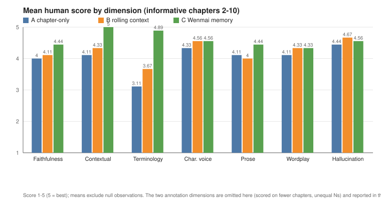
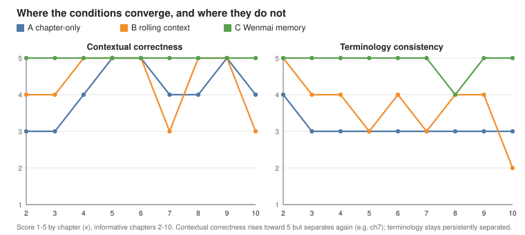

# LOTM benchmark results: run `lotm-opus48-v1`, chapters 1-10 (final blind phase)

Derived, methodology-safe summary. No source text, reference translations, or generated chapter
prose appear here; only condition labels, scores, deterministic outcomes, and short terminology
examples. The corpus, generated candidates, official reference translation, raw extraction
proposals, and local curation stay under `.local/` and are git-ignored.

This document supersedes the earlier
[chapters 1-6 checkpoint](lotm-opus48-v1_ch00001-ch00006.md) as the current cumulative view. That
file and the [chapters 1-3 checkpoint](lotm-opus48-v1_ch00001-ch00003.md) are kept unchanged as
historical provenance, and their figures (`assets/dimension_means.svg`,
`assets/ctx_term_progression.svg`) still render the data that was true when they were published.

This is the end of the controlled **blind** generation/evaluation phase. The official English
translation has **not** been inspected; a reference comparison is a later, separate phase.

## Run metadata

| Field | Value |
|---|---|
| Run ID | `lotm-opus48-v1` |
| Backend | `claude_code_stateless` (subscription-backed, one fresh `claude -p` per candidate) |
| Model | `claude-opus-4-8` (no thinking configuration) |
| Mode | `independent` (each condition keeps its own translation history) |
| Chapters | 1-10 complete |
| Informative chapters | 2-10 (**n = 9**); chapter 1 non-informative |
| Canonical state | human-reviewed and frozen through `ch00010` |
| Strict validation | 0 errors, 0 warnings (`--require-first-seen`) |
| Preflight (1-10) | ready |
| Test suite | 85 passed |

## The three conditions

All three conditions share the same model, settings, prompt assembler, and style guide. Only the
context included in the prompt differs. None of the three was tuned to win; they are three points on
a "how much context" axis.

- **A - chapter-only.** The current source chapter plus the shared translation instructions and
  style guide. No prior translation history, no structured canonical state, no translation memory.
- **B - rolling context.** The current source chapter plus B's own previous translations (a rolling
  window). No structured canonical context, no translation memory. B never receives frozen
  terminology or curated state; any consistency it shows comes only from its own recent output.
- **C - Wenmai with persistent, human-reviewed memory.** The current source chapter plus C's own
  previous translations, plus bounded human-reviewed canonical state (characters, terminology,
  locations, factions, timeline) and bounded human-reviewed translation memory. Both stores are
  chapter-bounded, so translating chapter *i* can only see material first established before chapter
  *i*.

Scoring is blind: candidates are presented as 1/2/3 and the label-to-condition map is withheld until
after scoring is frozen. Human-assisted model scores are 1-5 (5 = best);
`hallucination_or_embellishment` uses 5 = no unsupported additions. Deterministic `fmt` = automated
formatting validity (front matter present + a single H1).

## Per-chapter blind scores (unblinded after freezing)

Dimensions: faith = faithfulness, ctx = contextual_correctness, term = terminology_consistency,
voice = character_voice_consistency, prose = english_prose_quality, word = wordplay_preservation,
ann_p = annotation_precision, ann_r = annotation_restraint, halluc = hallucination_or_embellishment.
`n/a` = the evaluator left the dimension null for that chapter. Every mapping below is read from the
frozen `_blinding/chNNNNN.json`, never inferred from prose.

### Chapter 1 (mapping: candidate 1 = C, 2 = B, 3 = A) - NON-INFORMATIVE

At chapter 1 there is no prior history and the canonical stores are empty, so A/B/C receive
**effectively equivalent prompts**. Any score differences are sampling variance across the three
isolated processes, not a context effect. `ctx` is not applicable.

| Cond | faith | ctx | term | voice | prose | word | ann_p | ann_r | halluc | fmt |
|------|:---:|:---:|:---:|:---:|:---:|:---:|:---:|:---:|:---:|:---:|
| A | 4 | n/a | 5 | 4 | 3 | 4 | 5 | 5 | 4 | invalid |
| B | 4 | n/a | 4 | 4 | 4 | 4 | 5 | 5 | 4 | valid |
| C | 4 | n/a | 5 | 4 | 4 | 4 | 5 | 5 | 5 | valid |

Mean human score: A 4.25, B 4.25, C 4.50. **Ranking not meaningful** (equivalent prompts). Excluded
from all aggregates below.

### Chapter 2 (mapping: candidate 1 = B, 2 = A, 3 = C) - INFORMATIVE

| Cond | faith | ctx | term | voice | prose | word | ann_p | ann_r | halluc | fmt |
|------|:---:|:---:|:---:|:---:|:---:|:---:|:---:|:---:|:---:|:---:|
| A | 4 | 3 | 4 | 4 | 4 | 4 | n/a | 5 | 5 | invalid |
| B | 4 | 4 | 5 | 4 | 4 | 4 | n/a | 5 | 5 | invalid |
| C | 4 | 5 | 5 | 4 | 5 | 4 | n/a | 5 | 5 | valid |

Mean: A 4.12, B 4.38, C 4.62. **Ranking: C > B > A.**

### Chapter 3 (mapping: candidate 1 = A, 2 = B, 3 = C) - INFORMATIVE

| Cond | faith | ctx | term | voice | prose | word | ann_p | ann_r | halluc | fmt |
|------|:---:|:---:|:---:|:---:|:---:|:---:|:---:|:---:|:---:|:---:|
| A | 3 | 3 | 3 | 4 | 4 | 4 | n/a | 5 | 4 | valid |
| B | 4 | 4 | 4 | 5 | 4 | 5 | n/a | 5 | 5 | invalid |
| C | 4 | 5 | 5 | 4 | 5 | 4 | n/a | 5 | 5 | invalid |

Mean: A 3.75, B 4.50, C 4.62. **Ranking: C > B > A.**

### Chapter 4 (mapping: candidate 1 = A, 2 = B, 3 = C) - INFORMATIVE

| Cond | faith | ctx | term | voice | prose | word | ann_p | ann_r | halluc | fmt |
|------|:---:|:---:|:---:|:---:|:---:|:---:|:---:|:---:|:---:|:---:|
| A | 4 | 4 | 3 | 4 | 4 | 4 | n/a | 5 | 5 | valid |
| B | 4 | 5 | 4 | 5 | 4 | 4 | n/a | 5 | 5 | valid |
| C | 5 | 5 | 5 | 5 | 4 | 4 | n/a | 5 | 4 | invalid |

Mean: A 4.12, B 4.50, C 4.62. **Ranking: C > B > A.**

### Chapter 5 (mapping: candidate 1 = C, 2 = B, 3 = A) - INFORMATIVE

| Cond | faith | ctx | term | voice | prose | word | ann_p | ann_r | halluc | fmt |
|------|:---:|:---:|:---:|:---:|:---:|:---:|:---:|:---:|:---:|:---:|
| A | 4 | 5 | 3 | 4 | 4 | 4 | 4 | 5 | 4 | valid |
| B | 4 | 5 | 3 | 4 | 4 | 4 | 3 | 5 | 4 | valid |
| C | 4 | 5 | 5 | 4 | 5 | 4 | 4 | 5 | 4 | valid |

Mean: A 4.11, B 4.00, C 4.44. **Ranking: C > A > B.** First informative chapter where B did not
place second: B is not mechanically superior to A.

### Chapter 6 (mapping: candidate 1 = B, 2 = C, 3 = A) - INFORMATIVE

| Cond | faith | ctx | term | voice | prose | word | ann_p | ann_r | halluc | fmt |
|------|:---:|:---:|:---:|:---:|:---:|:---:|:---:|:---:|:---:|:---:|
| A | 4 | 5 | 3 | 4 | 4 | 4 | n/a | 5 | 4 | valid |
| B | 4 | 5 | 4 | 4 | 4 | 4 | n/a | 5 | 5 | valid |
| C | 5 | 5 | 5 | 5 | 4 | 5 | n/a | 5 | 5 | valid |

Mean: A 4.12, B 4.38, C 4.88. **Ranking: C > B > A.**

### Chapter 7 (mapping: candidate 1 = A, 2 = C, 3 = B) - INFORMATIVE

| Cond | faith | ctx | term | voice | prose | word | ann_p | ann_r | halluc | fmt |
|------|:---:|:---:|:---:|:---:|:---:|:---:|:---:|:---:|:---:|:---:|
| A | 4 | 4 | 3 | 5 | 5 | 4 | n/a | n/a | 5 | valid |
| B | 4 | 3 | 3 | 5 | 4 | 4 | n/a | n/a | 5 | invalid |
| C | 5 | 5 | 5 | 5 | 4 | 5 | n/a | n/a | 5 | valid |

Mean: A 4.29, B 4.00, C 4.86. **Ranking: C > A > B.** Note the renewed contextual separation: A and
especially B dropped on `ctx` here rather than all three staying saturated at 5.

### Chapter 8 (mapping: candidate 1 = C, 2 = A, 3 = B) - INFORMATIVE

| Cond | faith | ctx | term | voice | prose | word | ann_p | ann_r | halluc | fmt |
|------|:---:|:---:|:---:|:---:|:---:|:---:|:---:|:---:|:---:|:---:|
| A | 5 | 4 | 3 | 5 | 4 | 5 | n/a | n/a | 5 | valid |
| B | 4 | 5 | 4 | 5 | 4 | 5 | n/a | n/a | 4 | invalid |
| C | 4 | 5 | 4 | 5 | 5 | 5 | n/a | n/a | 4 | valid |

Mean: A 4.43, B 4.43, C 4.57. **Ranking: C > A > B.** A and B tie on the mean (and on the
seven-common-dimension total, 31 each). The A-over-B ordering was **not** taken from arithmetic: it
comes from the same evaluator's **explicit blind tie-break, recorded before unblinding** (frozen
`candidate 1 > candidate 2 > candidate 3`), which placed candidate 2 (A) over candidate 3 (B) on
stronger direct source faithfulness and lower embellishment.

### Chapter 9 (mapping: candidate 1 = B, 2 = C, 3 = A) - INFORMATIVE - COUNTER-SIGNAL

| Cond | faith | ctx | term | voice | prose | word | ann_p | ann_r | halluc | fmt |
|------|:---:|:---:|:---:|:---:|:---:|:---:|:---:|:---:|:---:|:---:|
| A | 4 | 5 | 3 | 4 | 4 | 4 | n/a | n/a | 4 | invalid |
| B | 5 | 5 | 4 | 5 | 4 | 5 | n/a | n/a | 5 | valid |
| C | 5 | 5 | 5 | 4 | 4 | 4 | n/a | n/a | 5 | valid |

Mean: A 4.00, B 4.71, C 4.57. **Ranking: B > C > A.** This is a genuine counter-signal and is not
softened here. **C still had the best terminology-consistency score (5 vs B's 4)**, yet **B won the
chapter** through stronger character voice and comic register (voice 5 vs C's 4) plus a higher
hallucination/embellishment score. B does **not** receive any frozen terminology state; it did not
win by "terminology continuity." Chapter 9 is a direct counterexample to the claim that the strongest
persistent terminology continuity must yield the best overall translation.

### Chapter 10 (mapping: candidate 1 = A, 2 = B, 3 = C) - INFORMATIVE

| Cond | faith | ctx | term | voice | prose | word | ann_p | ann_r | halluc | fmt |
|------|:---:|:---:|:---:|:---:|:---:|:---:|:---:|:---:|:---:|:---:|
| A | 4 | 4 | 3 | 5 | 4 | 4 | 3 | 3 | 4 | valid |
| B | 4 | 3 | 2 | 4 | 4 | 4 | 3 | 3 | 4 | valid |
| C | 4 | 5 | 5 | 5 | 4 | 4 | n/a | n/a | 4 | valid |

Mean: A 3.78, B 3.44, C 4.43. **Ranking: C > A > B** (frozen blind ranking
`candidate 3 > candidate 1 > candidate 2`). Here B drops below A: its rolling window drifted on
established names (terminology 2, contextual 3) while C held frozen renderings.

## Informative sample and headline

Chapter 1 is non-informative (equivalent prompts). The experimental sample is **chapters 2-10,
n = 9 informative chapters**. All counts below are derived from the frozen mappings and rankings.

- **C first: 8/9** informative chapters (all except chapter 9).
- **B over A: 5/9** (chapters 2, 3, 4, 6, 9).
- **A over B: 4/9** (chapters 5, 7, 8, 10); chapter 8's A-over-B ordering is the evaluator's frozen
  blind tie-break, not an arithmetic margin.
- **B first: 1/9** (chapter 9, the counter-signal).

Eight out of nine is **repeated directional evidence, not statistical proof and not evidence of
universal superiority**. With n = 9, a single run, one evaluator family, and ordinal scores, there is
no statistical power here; it is a directional result with an explicit counter-example.

## Dimension-level analysis (means over informative chapters 2-10)

Means are computed directly from the frozen evaluations over the nine informative chapters, averaging
only non-null values. These are **not** the earlier chapters 2-6 means.

| Dimension | A | B | C | N/cond |
|---|:---:|:---:|:---:|:---:|
| faithfulness | 4.00 | 4.11 | 4.44 | 9 |
| contextual_correctness | 4.11 | 4.33 | 5.00 | 9 |
| terminology_consistency | 3.11 | 3.67 | 4.89 | 9 |
| character_voice_consistency | 4.33 | 4.56 | 4.56 | 9 |
| english_prose_quality | 4.11 | 4.00 | 4.44 | 9 |
| wordplay_preservation | 4.11 | 4.33 | 4.33 | 9 |
| hallucination_or_embellishment | 4.44 | 4.67 | 4.56 | 9 |

Annotation dimensions are reported separately because their applicability differs and they are **not**
directly comparable to the nine-chapter literary means:

- `annotation_restraint`: A 4.67 (n=6), B 4.67 (n=6), C 5.00 (n=5). Scored only where a candidate
  carried annotations.
- `annotation_precision`: A 3.50 (n=2), B 3.00 (n=2), C 4.00 (n=1). Too few observations to compare;
  do not read these as stable means.

### Contextual-correctness progression (chapters 2-10)

| Chapter | 2 | 3 | 4 | 5 | 6 | 7 | 8 | 9 | 10 |
|---|:---:|:---:|:---:|:---:|:---:|:---:|:---:|:---:|:---:|
| A | 3 | 3 | 4 | 5 | 5 | 4 | 4 | 5 | 4 |
| B | 4 | 4 | 5 | 5 | 5 | 3 | 5 | 5 | 3 |
| C | 5 | 5 | 5 | 5 | 5 | 5 | 5 | 5 | 5 |

### Terminology-consistency progression (chapters 2-10)

| Chapter | 2 | 3 | 4 | 5 | 6 | 7 | 8 | 9 | 10 |
|---|:---:|:---:|:---:|:---:|:---:|:---:|:---:|:---:|:---:|
| A | 4 | 3 | 3 | 3 | 3 | 3 | 3 | 3 | 3 |
| B | 5 | 4 | 4 | 3 | 4 | 3 | 4 | 4 | 2 |
| C | 5 | 5 | 5 | 5 | 5 | 5 | 4 | 5 | 5 |

The fuller sample corrects an over-broad reading from the six-chapter checkpoint. Contextual
correctness does **not** permanently saturate after chapter 5: chapter 7 shows renewed separation (A
4, B 3), and B drops again at chapter 10 (3). Chapter-only A recovers local narrative context
surprisingly often, but not always. Terminology consistency stays the most persistently separated
dimension: A drifts steadily at 3, B fluctuates 2-5 with its rolling window (dropping to 2 at chapter
10), and C stays at 5 except for a single dip to 4 at chapter 8.

### Narrative continuity vs translation-state continuity

Two things a long translation must keep consistent:

- **Narrative continuity**: understanding what is happening (who is who, what a scene refers to),
  mostly measured by `contextual_correctness`.
- **Translation-state continuity**: rendering the same source item the same way every time (the
  frozen `Kingdom of Loen`, `fortune-changing ritual`, `Sequence 9`, `Awa County`, `Welch Magven`),
  mostly measured by `terminology_consistency`.

Over all nine informative chapters, the durable pattern is: rolling context B can be very strong on
narrative continuity and even wins a chapter (9); chapter-only A can recover local narrative state
well; but C's most persistent advantage is maintaining explicit, previously-decided renderings.
Structured memory did **not** guarantee the best prose, voice, wordplay, or an every-chapter win, as
chapter 9 shows directly.

## Where C did not dominate

Honest counter-evidence, retained:

- **Chapter 9: B > C > A** - C led terminology but lost the chapter on voice and comic register.
- **Character voice**: B ties C on the mean (both 4.56).
- **Wordplay**: B ties C on the mean (both 4.33).
- **Hallucination / embellishment**: B has the *best* mean (4.67), ahead of C (4.56) and A (4.44).
  More state did not make C the most restrained.
- **Prose**: C leads the mean (4.44), but A (4.11) is above B (4.00) - B's prose mean is the lowest.
- **Chapter 8**: A and B tie exactly on the mean; the ordering needed an explicit blind tie-break.
- **Annotation precision**: on its two shared chapters A (3.5) is above B (3.0), and C has only one
  scored chapter.

C leads the aggregate and the two continuity dimensions, but it is not uniformly best.

## Deterministic formatting

Formatting validity was independent of condition across all ten chapters. The invalidating pattern is
always the same code-fence wrapping (the whole Markdown document emitted inside a fence, so the front
matter is not recognized), landing on different conditions each chapter: ch1 A; ch2 A+B; ch3 B+C; ch4
C; ch5 none; ch6 none; ch7 B; ch8 B; ch9 A; ch10 none. It does not track literary quality - in
chapters 3 and 4 the highest-scored candidate (C) was the one flagged, and chapter 10's clear winner
(C) was valid alongside everyone else. It is a per-process output artifact of the stateless CLI
backend, caught automatically and deliberately left uncorrected so it stays a visible outcome. **No
candidate in any of the ten chapters used a banned terminology variant** (`banned_variant_count` = 0
throughout).

## Fresh-evaluator protocol (chapters 4-10)

From chapter 4 onward, each chapter was scored in a **fresh, independent evaluator session** (a blind,
model-assisted evaluation, not a human evaluator). Chapters 4-10 - seven chapters - were scored this
way. Each fresh session received only: the fixed rubric, the current Chinese source chapter, the
blinded Candidate 1/2/3 translations, the deterministic result, a blank schema, and the canonical
state established *before* that chapter. Each was deliberately **not** given prior candidate-to-
condition mappings, previous rankings, any statement of the expected winner, previous evaluator
comments, or previous candidate-number patterns. External / reference LOTM material was prohibited.

Evidence against a trivial candidate-number preference: the winning **candidate number** varied across
the seven fresh sessions (ch4 #3, ch5 #1, ch6 #2, ch7 #2, ch8 #1, ch9 #1, ch10 #3). Six of the seven
fresh-session winners unblinded to Condition C; chapter 9's winner unblinded to Condition B, the
counter-signal. Chapter 8 additionally required an **explicit blind tie-break between two numerically
tied candidates**, resolved before unblinding. This reduces, but does not eliminate, evaluator bias.
Chapters 2-3 were not run under this protocol and are not described as if they were.

## What the state-extraction audit is teaching us

Persistent memory has its own failure surface: the automatic extractor can convert plausible but
unsupported model "knowledge" into durable future context. In this run, human review repeatedly
caught that before it entered canonical state. Summarized without reproducing any source passages
(chapters 1-6 are covered in the previous checkpoint; the additions here are chapters 7-10):

- **Chapter 7**: review prevented incidental-entity promotion, epistemic overstatement, a settlement
  classification not in the source, and premature promotion of a one-off phrase/joke to recurring
  status. Codename adoptions (Justice, The Hanged Man) and the Tarot Club were kept as source-grounded.
- **Chapter 8**: the sharpest audit example so far - **the extractor turned a character's deliberate
  lie into objective reality**. It recorded the ghost-ship "Captain" as having survived/escaped, when
  the chapter shows that "escape" is a *deception* the character tells his companion after apparently
  killing him. Review restored the source sequence. It also over-inferred Church of the Lord of Storms
  membership from a shared salute, generalized one ghost ship's properties to the whole category,
  invented a `phlogiston` avoid rule, and prematurely classed a same-scene salute as recurring.
- **Chapter 9**: the extractor attributed an unattributed in-text "fear of the unknown" line to
  **Lovecraft** - external pretrained-world knowledge with no basis in the Chinese source. This is
  distinct from later-story LOTM leakage: it is generic model-prior leakage. Review also fixed a
  four-dot event-sequence slip, tightened the Antigonus "seems"/`似乎` hedge back to uncertainty,
  removed an unsupported seven-churches-to-deities correspondence, and held the conservative
  translation-memory policy.
- **Chapter 10**: review corrected an over-strong upgrade of Klein's *inferred* inspector rank into
  fact, a simplification of his strategic partial truth into "feigned amnesia," a risk of turning
  search-warrant *uncertainty* into settled law, over-promotion of incidentally-listed schools,
  premature TM classification of a same-chapter title/dialogue echo, and a one-off `键盘专家`
  proposed for TM against the established exact-recurrence policy.

Across all ten chapters the pattern holds: human review does more than polish extracted memory - it
repeatedly stops plausible-but-unsupported material, including two distinct leakage types (later-story
detail and generic pretrained-world knowledge like the Lovecraft attribution), from becoming
persistent context. In this run, **persistent memory behaves as a curated state-management problem,
not merely an extraction problem.** This is an observation from the current run, not a universal proof.

## Final blind-phase conclusion

Across nine informative chapters in this run, structured, human-reviewed persistent memory produced
the most consistent overall blind ranking (C first in 8 of 9) and the clearest sustained terminology
advantage (mean 4.89 vs B 3.67 vs A 3.11). The result is **not uniform**: rolling context won chapter
9 despite C retaining stronger terminology, C did not lead every literary dimension (B had the best
hallucination mean and tied C on voice and wordplay), and chapter 8 needed a tie-break. The evidence
therefore supports a **narrower** claim than "more context is always better": explicitly curated
translation state appears useful for preserving long-range translation decisions, while literary
quality still depends on source fidelity, voice, prose, and judgment that memory alone does not
guarantee.

This closes the controlled blind phase. It is **not** yet an official-reference comparison.

## Methodological limitations

- One novel / corpus; Chinese to English only.
- One primary model / backend (`claude-opus-4-8`, `claude_code_stateless`).
- Nine informative chapters; ordinal, human-assisted scores; a single run.
- Evaluator sessions use language models and cannot fully eliminate latent-pretraining knowledge; the
  chapter-9 Lovecraft attribution shows that surface directly.
- The source novel is well known enough that model-weight familiarity cannot be ruled out.
- Fresh evaluator sessions (chapters 4-10) reduce but do not eliminate evaluator bias.
- Condition C includes human review, so this measures the full reviewed-memory workflow, not purely
  automatic retrieval.

The official English translation remains withheld from all prompting and evaluation. It is an
after-the-fact comparison aid for a later phase and has not been inspected for this checkpoint.
